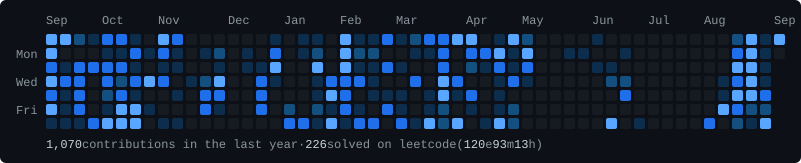

  

# Manan Kapoor

Computer engineering student working on ML systems — LLM inference, memory-efficient
model serving, and the data pipelines that feed fine-tuning. Mostly interested in where
latency, memory, and throughput actually bind.

[github](https://github.com/manankapoor23) ·
[linkedin](https://www.linkedin.com/in/manan-kapoor-8545002a0/) ·
[email](mailto:23.kapoormanan@gmail.com)

## Work

**KV-Paged inference for transformers** — a paging-based KV cache that decouples logical
token positions from physical memory, with prefix reuse, reference counting, and
copy-on-write sharing. Cuts redundant allocation in long-context decoding; numerics
verified against naive attention to within 0.1%.

**PLC-Rewrite** — data engineering for Punjabi LLM fine-tuning. 16M+ tokens across 1.1M+
sentences, deduplicated and noise-filtered into schema-validated JSONL for instruction
tuning and evaluation.

**Natural language → SQL** — schema-aware SQL generation over structured databases,
executed and formatted back to the user through a FastAPI and LangChain service in Slack.

## Experience

**NLP Research Intern**, Thapar Institute of Engineering & Technology — 2025 to present.
Built the data pipelines behind Punjabi LLM fine-tuning: deduplication, normalization,
and validation across 16.2M tokens, with reproducibility as the constraint that mattered.

## Tools

Python, C++ · PyTorch, Transformers, Hugging Face, LangChain · FastAPI, PostgreSQL ·
Docker, MLflow, DVC, Airflow
